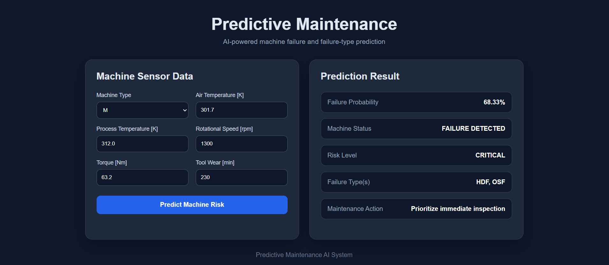

<div align="center">

# 🤖 Predictive Maintenance AI System

### Machine Failure & Failure-Type Prediction

**Ahmed Mohamed Wally**  
Artificial Intelligence Student | Intelligent Systems


</div>

---

## 📸 Dashboard

> Add your dashboard screenshot as `assets/dashboard.png`.



---

## 🎯 Overview

An end-to-end AI system that analyzes machine sensor data to:

- predict whether a machine is likely to fail
- identify the likely failure type(s)
- assign a project-level risk level
- return a maintenance action

The system combines **Machine Learning, multi-label classification, FastAPI, and a web dashboard**.

---

## ⚙️ Architecture

```text
Sensor Data
    │
    ▼
EDA + Preprocessing
    │
    ▼
┌──────────────────────┐
│ Model 1              │
│ Machine Failure      │
│ Prediction           │
└──────────┬───────────┘
           │
      Failure detected?
        /          \
      No            Yes
      │              │
      ▼              ▼
   Normal       ┌──────────────────┐
                │ Model 2          │
                │ Failure Types    │
                │ Multi-Label      │
                └────────┬─────────┘
                         │
                         ▼
                    Risk + Action
                         │
                         ▼
                   FastAPI + UI
```

---

## 🧠 Models

### Model 1 — Machine Failure

**Random Forest** with balanced class weights.

**Inputs**

`Type` · `Air Temperature` · `Process Temperature` · `RPM` · `Torque` · `Tool Wear`

**Decision threshold:** `0.35`  
Selected using validation data with a recall constraint.

**Final test**

| Metric | Score |
|---|---:|
| Failure Precision | **0.5096** |
| Failure Recall | **0.7794** |
| Failure F1 | **0.6163** |
| Accuracy | **0.9670** |
| ROC-AUC | **0.9594** |
| PR-AUC | **0.7137** |

---

### Model 2 — Failure Types

Multi-label Random Forest using One-vs-Rest.

**Labels**

`TWF` · `HDF` · `PWF` · `OSF`

`RNF` is not modeled independently because the dataset contains only one positive RNF example.

**Final test**

| Metric | Score |
|---|---:|
| Micro F1 | **0.9091** |
| Macro F1 | **0.9222** |
| Micro Recall | **0.9155** |
| Macro Recall | **0.9292** |

---

## 📊 Dataset

`data/predictive_maintenance.csv`

**10,000 samples · 14 columns · 339 failures**

Failure rate: **3.39%**

Main sensor features:

```text
Machine Type
Air Temperature [K]
Process Temperature [K]
Rotational Speed [rpm]
Torque [Nm]
Tool Wear [min]
```

The strong class imbalance is why the project emphasizes precision, recall, F1, ROC-AUC, and PR-AUC rather than accuracy alone.

---

## 🌐 API

Start the backend:

```bash
python -m uvicorn src.api:app --reload
```

API documentation:

```text
http://127.0.0.1:8000/docs
```

### `POST /predict`

Example request:

```json
{
  "machine_type": "M",
  "air_temp": 301.7,
  "process_temp": 312.0,
  "rpm": 1300,
  "torque": 63.2,
  "tool_wear": 230
}
```

Example response:

```json
{
  "failure_probability": 0.6833,
  "failure": true,
  "failure_types": ["HDF", "OSF"],
  "failure_type_status": "Specific failure type(s) identified.",
  "risk": "CRITICAL",
  "maintenance_action": "Prioritize immediate inspection"
}
```

---

## 🖥️ Run the Dashboard

With the API running, open:

```text
dashboard/index.html
```

Enter the sensor values and click:

**Predict Machine Risk**

---

## 🧪 Testing

Run all tests:

```bash
python -m unittest discover -s tests -v
```

Current result:

```text
Ran 6 tests
OK
```

Additional checks:

```bash
python -m compileall src tests
python -m pip check
```

---

## 📁 Project Structure

```text
ziad_predictive_maintenance_organized/
├── dashboard/
├── data/
├── models/
├── notebooks/
│   ├── 01_eda.ipynb
│   ├── 02_preprocessing.ipynb
│   ├── 03_model_failure.ipynb
│   ├── 04_model_failure_types.ipynb
│   └── 05_inference_demo.ipynb
├── outputs/
├── src/
│   ├── api.py
│   └── inference.py
├── tests/
│   ├── test_api.py
│   └── test_inference.py
├── .gitignore
├── README.md
└── requirements.txt
```

---

## ▶️ Quick Start

```bash
python -m venv .venv
.\.venv\Scripts\Activate.ps1
python -m pip install -r requirements.txt
python -m uvicorn src.api:app --reload
```

Then open:

```text
http://127.0.0.1:8000/docs
```

---

## ⚠️ Limitations

- The dataset is not live factory telemetry.
- Risk levels and maintenance actions are project-level rules, not industrial safety standards.
- `RNF` is too rare for reliable standalone modeling in this version.
- Model 2 uses the standard binary decision behavior for each label.
- This is a portfolio/research project and is not a certified industrial maintenance system.

---

## 🔮 Future Improvements

- Per-label threshold optimization
- Probability calibration
- SHAP / model explainability
- Real-time sensor streaming
- Prediction history
- Model monitoring
- Data drift detection
- Production deployment

---

## 👨‍💻 Author

**Ahmed Mohamed Wally**

Artificial Intelligence Student — Intelligent Systems

**Focus:** Machine Learning · Deep Learning · Computer Vision · Data Analysis · AI Applications

---

<div align="center">

**From sensor data → AI models → API → dashboard**

</div>
